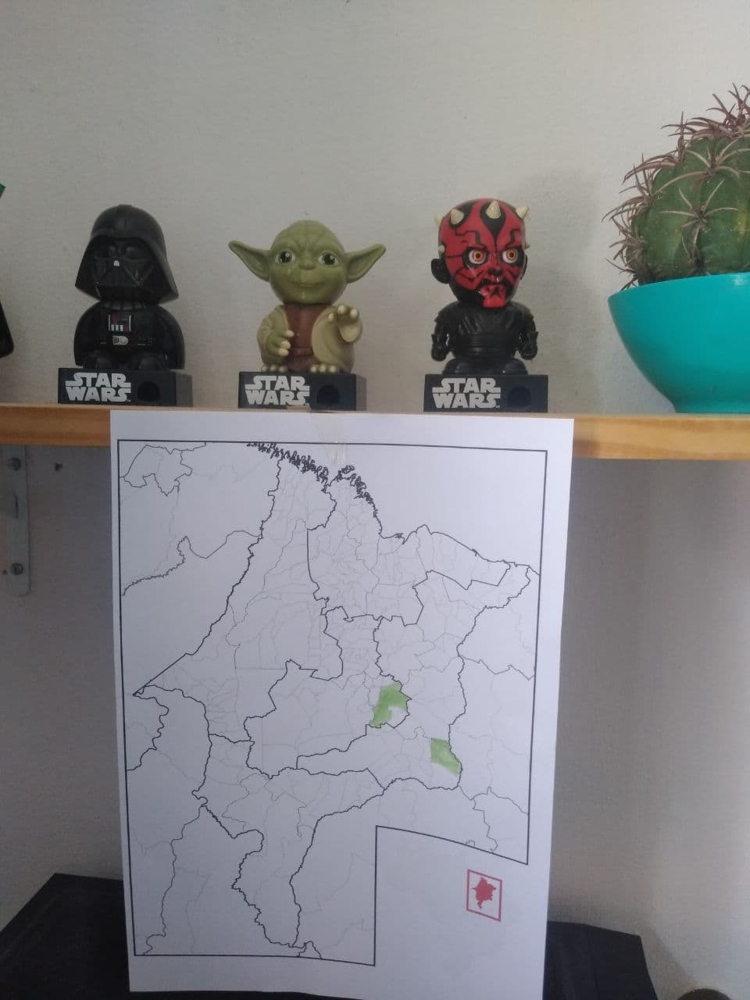

---
title: "Mapper van de maand: PlayzinhoAgro (Brazilië)"
featured:
layout: post
category: motm
author: Pierre Parmentier
lang: nl
---

Zijn [homepage](https://www.openstreetmap.org/user/PlayzinhoAgro) and zijn [bijdragerpagina](https://hdyc.neis-one.org/?PlayzinhoAgro).

## Wil je jezelf even voorstellen aan onze lezers?

Mijn naam is Gustavo Soares (PlayzinhoAgro). Met de quarantaine werd ik uiteindelijk een voltijds vrijwilliger mapper. Ik ben ook een [ElementaryOS](https://elementary.io/) fanboy en vrije software activist. Mijn favoriete editor was IDv3 en ik heb geprobeerd JOSM te gebruiken. Ik heb een instance van het DAMN project [Divide and map. Now.](https://www.damn-project.org/) gebruikt als een task manager. Het is een geweldig alternatief voor de zelf gehoste HOT-taakmanager vooral omdat het licht is. In het begin gebruikte ik een server met 500mb en 1vCPU die eenvoudig te installeren is. Vroeger bracht ik steden in de staat Maranhão in Brazilië in kaart. Op dit moment werk ik in Timon (Maranhão) waar ik momenteel leef, maar ik plaats altijd nieuwe gebieden in de [Mapeia.space](https://tarefas.mapeia.space/).

## Hoe en wanneer heb je OpenStreetMap ontdekt?

Eind 2019 kreeg ik voor het eerst de kans om met OpenStreetMap te werken, terwijl ik op zoek was naar alternatieven voor Google Maps. Daarvoor was het één van de eerste lokale gidsen in de regio geweest. Een paar maanden later slaagde ik erin om een PC te bouwen en sindsdien ben ik bijna elke dag begonnen met het in kaart brengen.

## Hoe gebruik je OpenStreetMap?

Met deze quarantaine en de noodzaak van isolatie gebruik ik weinig voor de navigatie. Tegenwoordig ben ik 80% aan het bewerken en de andere 20% aan het zien van de gerenderde kaarten.

## Wat voor soort bijdrager ben je en in welk kaartgebied map je?

Ik denk dat ik mezelf kan definiëren als een voltijdse vrijwilligerskapitein, en ik breng steden in mijn staat en naburige regio's in kaart.

## Wat ben je in kaart aan het brengen? Heb je een specialisatie?

Ik beschouw mezelf graag als een generieke mapper. Voor mij is het maken van een basiskaart het belangrijkste, dus wat ik uiteindelijk het meest in kaart breng is wat je per satelliet kunt zien: gebouwen, wegen, water, enz.

## Waar ben je het meest trots op als mapper?

Voor mij zijn het er uiteindelijk twee: mijn eerste 1k in OpenStreetMap, en nu wordt ik geïnterviewd als de Mapper van de maand.

## Waarom breng je het in kaart? Wat motiveert je?

Ik zou zeggen dat ik uiteindelijk mijn plaats bij OpenStreetMap heb gevonden. Ik heb problemen met aandacht en angst, en OpenStreetMap hielp me uiteindelijk om me beter te voelen omdat het iets is wat ik goed kan doen. Op dit moment zie ik het als mijn manier om bij te dragen aan een betere wereld en aan de FLOSS-gemeenschap (omdat ik moeite heb om te leren programmeren). Soms denk ik aan iemand die Strava of een andere applicatie gebruikt die OpenStreetMap als basis gebruikt en vind ik het interessant dat de kaart met mijn bijdrage is bijgewerkt.

## Heb je ideeën over hoe we de OpenStreetMap-gemeenschap kunnen uitbreiden of meer mappers kunnen motiveren?

Ik denk dat we allemaal de OpenStreetMap-gemeenschap kunnen laten groeien door de vooruitgang op de sociale netwerken te delen; niet alleen in OpenStreetMap-groepen, maar ook met mensen die dicht bij ons staan. Ik denk dat erkenning onder andere, zoals Mapper van de maand België, belangrijk is om de gemeenschap gemotiveerd te houden en vooruitgang te boeken.

## Heb je contact met andere mappers?

Ja, voornamelijk door Telegram groepen van OSM BR.

## Naar uw mening wat is de grootste kracht van OpenStreetMap?

Voor mij is de grootste kracht van OpenStreetMap dat het open software is. Dit biedt de mogelijkheid om gemeenschappen van mappers over de hele wereld op te bouwen!

## Wat is de grootste uitdaging voor OpenStreetMap?

Ik denk dat we voor twee grote uitdagingen staan: de eerste is dat onze gemeenschap nog klein is — we hebben meer lokale uitgevers nodig om ze niet alleen in kaart te brengen maar ook up-to-date te houden. Het andere probleem is dat we nog niet weten welke impact de invloed van Big Tech op OpenStreetMap kan hebben.

## Hoe blijf je op de hoogte van het OpenStreetMap-nieuws?

OSMWeekly (bedankt aan Portugese vertalers), reddit/OpenStreetMap en de groepen van uw gemeenschap.

## Om af te sluiten, is er nog iets dat je aan de lezerzou willen vertellen?

Ik wil je bedanken voor het feit dat je mij voor dit interview hebt gebeld. Ik nodig iedereen uit die een bezoek wil brengen en een bijdrage wil leveren aan [Mapeia.space](https://tarefas.mapeia.space/). Op dit moment wordt mijn werk ondersteund door donaties, en als je kun, doe dan een donatie: mijn [liberapay](https://liberapay.com/gustavo22soares).

**Dank je, Gustavo, voor dit interview.**

*Vertaald uit het Engels door Claire Muyllaert en Pierre Parmentier met behulp van DeepL Translator.*
