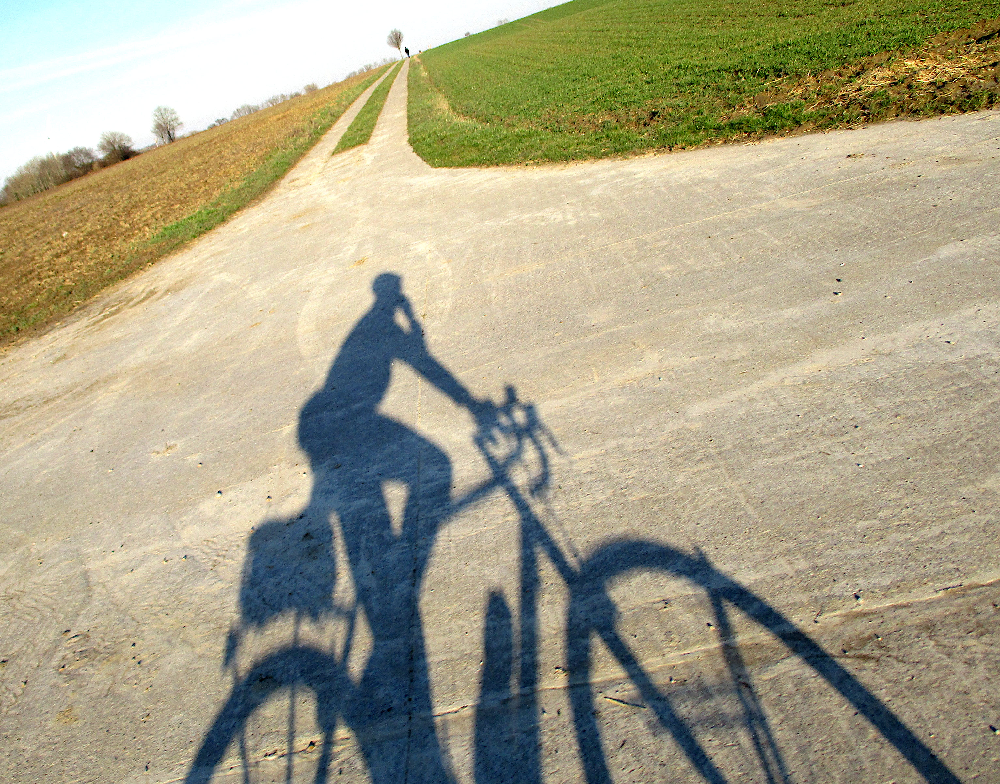

---
title: "Mapper of the Month: Eebie (Belgium)"
featured: 20210306T170422.JPG
layout: post
category: motm
author: Pierre Parmentier
lang: en
---

His [homepage](https://www.openstreetmap.org/user/Eebie) and his [contribution page](http://hdyc.neis-one.org/?Eebie).

## Hello Erik! Would you like to briefly introduce yourself to our readers?
My name is Erik and I live in Hasselt in Belgian Limburg. I map under my initials Eebie. I am 65 years old and recently retired.

## How and when did you get to know OpenStreetMap?
I started using OpenStreetMap in 2012 after buying a Garmin GPS for cycling. I had always been fascinated by maps and a few years before, I had come across OpenStreetmap on the internet when searching for online maps. Back then, OpenStreetMap was not interesting at all. Belgium was still almost completely blank. In 2012, however, OpenStreetMap was already usable. It contained enough larger roads not to get lost. The land consolidation roads in South Limburg, which are now popular cycling routes, were not yet on it. By figuring out how to get those missing roads on the map too, I became *contributor*.

## How do you use OpenStreetMap?
I am still a user of the Garmin eTrex 20. These days, I plan bicycle trips and hikes with *bikerouter.de*. For the car, I like *Magic Earth* better than *OsmAnd*. *OsmAnd* I use when I am unprepared somewhere on the road. When birdwatching, OpenStreetMap is the background map in the inventory apps. If I read or hear something about a particular place somewhere I check it on the internet. And if it is not already on OpenStreetMap I add it.

## What kind of contributor are you and in which area do you map?
When I'm out and about by bike or on foot, the Garmin records the route and with my little camera I photograph anything that needs to be added or changed With that camera, I can take pictures with one hand while riding or walking without looking. I then come home from a cycling trip with 300 to 500 photos to process. I have mainly been active in my region of Limburg. In recent years, I usually make cycling trips across the language border in Liège and Walloon Brabant as far as Namur.

## What are you mapping? Do you have a specialisation?
Bicycle paths, hiking trails and small paths have my special interest. This is also the strength of OpenStreetMap. I am a sporty cyclist and hiker with an interest in historical heritage. I enter monuments and special buildings with data from the Flemish and Walloon Heritage Services. By adding data from Wikipedia, I also started making contributions for Wikipedia and photos for Wikimedia. These also end up in OpenStreetMap. With Wikipedia in mind, I often work thematically. I made cycling trips to map and photograph medieval mottes, all the castles in \[the province of\] Liège and remains of coal and iron mines in Wallonia. If by bike is more difficult to reach then a walking tour is planned. This then includes everything I encounter along the way to map.

## What is your greatest achievement as mapper?
Looking at the map now, I am proud of what we have already managed to do together. I often used to think that it would be impossible to map all the streets in a reasonable time. We used to have only Bing aerial imagery and our own tracks and notes from on the ground. Meanwhile, so many organisations started to see the usefulness of OpenStreetMap and OpenData that a lot of data became available for use and adoption. 
In the beginning, I spent several years working on the marked walking routes in Central and South Limburg in particular. I used to do those while walking with my dog. Going down all those walks took me to places I would never have gone without OpenStreetMap. 
I was also pleasantly surprised when one day I received an OpenStreetMap map of Hasselt in the bus. Hasselt's city council had had it printed and distributed in all the mailboxes in Hasselt. Some time before, I had spent several weeks using the new GRB (1) Import Tool to add the missing buildings in Hasselt. Had they waited until all the buildings were on it before having that card printed?

## Why are you mapping? What motivates you?
I want to add to the map what is useful for someone like myself who uses the map. And I add what I myself find interesting. I will make less work of something that I myself would never look up on a map or something that I find unnecessary to give me an idea of a particular place. 
I find the Open Source and Crowd Sourcing idea very valuable. Doing something unpaid that benefits everyone gives it meaning.
I also enjoy doing it. Being behind the computer doing that allows you to clear your head. This has been useful on several occasions. And by processing the data of a trip afterwards, you experience it even more. And you get to know the environment better and more intensely.

## Do you have any ideas to expand the OpenStreetMap community, to motivate more people to contribute?
It's still amazing that people get motivated to figure out how to start contributing to OpenStreetMap on their own. I found it difficult and time-consuming to figure that out on my own. That you have to figure out a lot yourself is a weakness. That you can get a lot of fun out of it is a plus that made me and others persevere anyway. 
I'm a JOSM user and I can't rate the newer starter tools like iD and StreetComplete. I hope it will be smoother to start there without help than with JOSM. Fortunately, there are get-togethers in some places to learn something from each other. Mapathons where you get explanations and can start right away offer a nice entry option. I joined Jo Polyglot a few times at a Mapathon in Leuven, where a small auditorium got started with JOSM after 15 minutes of explanation. I personally regret that JOSM users are assumed to be IT nerds which still regularly gets me into trouble.

## Do you have contact with other mappers?
Sporadic contact is by email. The only time I have spent a day together with other mappers to exchange information was several years ago but what I pick up is still useful every day. For Meetups, distance is usually an objection, otherwise gladly. The few times a meetup was organised in Limburg, I unfortunately could not attend. I found the video conferences I followed very valuable, but the last one was a while ago.

## What is in your view the greatest strength of OpenStreetMap?
Meanwhile, the quality of the data is a major strength. That amount of detailed data is hard to find elsewhere and speaks for itself. And that strength comes from the large number of volunteer contributors who look after the data and do so globally.

## What are the largest challenges for OpenStreetMap?
Keeping the data up to date will be a challenge. Adding new because of it is more satisfying than updating detailed data and errors. I fear that updating will be less able to motivate new people. Hence, I am not in favour of too much detailed data that nobody cares about and will take a lot of energy to keep up to date. 
I also worry about where OpenStreetMap as a whole is going. I read that commercial companies making money with OpenStreetMap data are out to take control and are pushing employees to become voting members of the OpenStreetMap Foundation. I have already joined the OpenStreetMap Foundation myself just in case it is necessary to counterbalance somewhere so that OpenStreetMap remains available outside paid apps.

## How to do stay on top of news about OpenStreetMap?
I follow Belgian Talk-be emails and the forum but there is less movement there than before. Chat suits me less. I also get the OSMF-Talk now. Occasionally I read the *weeklyOSM* mentioned on the JOSM start-up screen and there I click through to interesting topics. 

## To conclude, is there anything else you want to share with the readers?
Let's get on with it, we're on a good track.

**Thank you, Erik, for this interview.**

*Translated from Dutch by Claire Muyllaert and Pierre Parmentier with the help of www.DeepL.com/Translator.*

