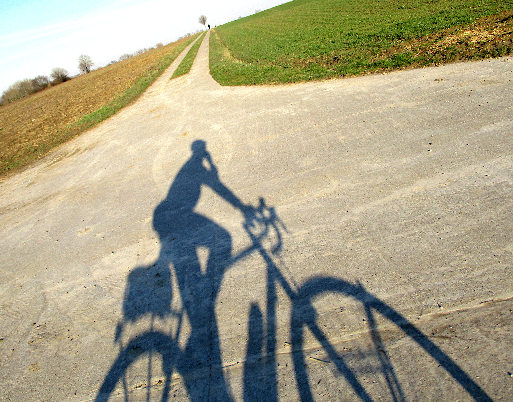

Sa [homepage](https://www.openstreetmap.org/user/Eebie) et sa [page de contribution](https://hdyc.neis-one.org/?Eebie).

## Bonjour Erik. Voudrais-tu te présenter brièvement à nos lecteurs ?
Je m'appelle Erik et j'habite à Hasselt dans le Limbourg belge. Je cartographie sous mes initiales Eebie. J'ai 65 ans et j'ai récemment pris ma retraite.

## Comment et quand as-tu découvert OpenStreetMap ?
J'ai commencé à utiliser OpenStreetMap en 2012 après avoir acheté un GPS Garmin pour le cyclisme. J'ai toujours été fasciné par les cartes et, quelques années auparavant, j'étais tombé sur OpenStreetmap sur internet en cherchant des cartes en ligne. À l'époque, OpenStreetMap n'était pas du tout intéressant. La Belgique était encore presque complètement vide. En 2012, cependant, OpenStreetMap était déjà utilisable. Il contenait suffisamment de grandes routes pour ne pas se perdre. Les routes de remembrement du sud du Limbourg, qui sont aujourd'hui des itinéraires cyclables populaires, n'y figuraient pas encore. En trouvant le moyen de faire figurer ces routes manquantes sur la carte, je suis devenu un *contributeur*.

## Comment utilises-tu OpenStreetMap ?
Je suis toujours un utilisateur du Garmin eTrex 20. Ces jours-ci, je planifie des voyages à vélo et des randonnées avec *bikerouter.de*. Pour la voiture, je préfère *Magic Earth* à *OsmAnd*. *OsmAnd* Je l'utilise quand je suis pris au dépourvu quelque part sur la route. Lors de l'observation des oiseaux, OpenStreetMap est la carte de fond dans les applications d'inventaire. Si je lis ou entends quelque chose à propos d'un endroit particulier, je le vérifie sur Internet. Et si elle n'est pas déjà sur OpenStreetMap, je l'ajoute.

## Quelle sorte de contributeur es-tu et dans quelle région cartographies-tu ?
Lorsque je me déplace à vélo ou à pied, le Garmin enregistre l'itinéraire et, avec mon petit appareil photo, je photographie tout ce qui doit être ajouté ou modifié. Avec cet appareil, je peux prendre des photos d'une main tout en roulant ou en marchant sans regarder. Je rentre ensuite d'une balade à vélo avec 300 à 500 photos à traiter. J'ai surtout été actif dans ma région du Limbourg. Ces dernières années, j'ai l'habitude de faire des excursions à vélo à travers la frontière linguistique de Liège et du Brabant wallon jusqu'à Namur.

## Que cartographies-tu ? As-tu une spécialisation ?
Les pistes cyclables, les sentiers de randonnée et les petits chemins m'intéressent tout particulièrement. C'est également la force d'OpenStreetMap. Je suis un cycliste et un randonneur sportif qui s'intéresse au patrimoine historique. Je saisis les monuments et les bâtiments spéciaux avec les données des services du patrimoine flamand et wallon. En ajoutant des données de Wikipedia, j'ai également commencé à faire des contributions pour Wikipedia et des photos pour Wikimedia. Ceux-ci se retrouvent également dans OpenStreetMap. Avec Wikipédia en tête, je travaille souvent de manière thématique. J'ai fait des excursions à vélo pour cartographier et photographier les mottes médiévales, tous les châteaux de \[la province de\] Liège et les vestiges des mines de charbon et de fer en Wallonie. Si l'accès en vélo est plus difficile, une visite à pied est prévue. Cela inclut ensuite tout ce que je rencontre sur le chemin de la carte.

## Quelle est ta plus grande prouesse en tant que contributeur ?
En regardant la carte maintenant, je suis fier de ce que nous avons déjà réussi à faire ensemble. J'ai souvent pensé qu'il serait impossible de cartographier toutes les rues en un temps raisonnable. Auparavant, nous ne disposions que des images aériennes de Bing et de nos propres traces et notes sur le terrain. Entre-temps, tant d'organisations ont commencé à voir l'utilité d'OpenStreetMap et d'OpenData qu'un grand nombre de données sont devenues disponibles pour être utilisées et adoptées. 
Au début, j'ai passé plusieurs années à travailler sur les itinéraires de randonnée balisés, notamment dans le centre et le sud du Limbourg. J'avais l'habitude de les faire en marchant avec mon chien. Toutes ces promenades m'ont fait découvrir des endroits où je ne serais jamais allé sans OpenStreetMap. 
J'ai également été agréablement surpris lorsqu'un jour j'ai reçu dans le bus une carte OpenStreetMap de Hasselt. Le conseil municipal d'Hasselt l'avait fait imprimer et distribuer dans toutes les boîtes aux lettres d'Hasselt. Quelque temps auparavant, j'avais passé plusieurs semaines à utiliser le nouvel outil d'importation GRB (1) pour ajouter les bâtiments manquants à Hasselt. Avait-on attendu que tous les bâtiments soient sur la carte avant de la faire imprimer ?

## Pourquoi cartographies-tu? Qu’est-ce qui te motive ?
Je veux ajouter à la carte ce qui est utile pour quelqu'un comme moi qui utilise la carte. Et j'ajoute ce que je trouve moi-même intéressant. Je ferai moins d'efforts pour quelque chose que je ne chercherais jamais moi-même sur une carte ou que je trouve inutile pour me donner une idée d'un lieu particulier. 
Je trouve l'idée de l'Open Source et du Crowd Sourcing très précieuse. Faire quelque chose de non rémunéré qui profite à tout le monde lui donne un sens.
J'aime aussi le faire. Être derrière l'ordinateur pour faire ça vous permet de vous vider la tête. Cela s'est avéré utile à plusieurs reprises. Et en traitant les données d'un voyage après coup, vous le vivez encore plus. Et vous apprenez à connaître l'environnement mieux et plus intensément.

## As-tu des idées pour élargir la communauté OpenStreetMap, pour motiver plus de gens à contribuer ?
Il est toujours étonnant que les gens se motivent pour trouver comment commencer à contribuer à OpenStreetMap par eux-mêmes. J'ai trouvé qu'il était difficile et long de trouver cette solution par moi-même. Le fait que tu doives découvrir beaucoup de choses par toi-même est une faiblesse. Le fait que l'on puisse y trouver beaucoup de plaisir est un atout qui m'a poussé, ainsi que d'autres, à persévérer malgré tout. 
Je suis un utilisateur de JOSM et je ne sais pas évaluer les nouveaux outils de saisie comme iD et StreetComplete. J'espère qu'il sera plus facile de commencer là sans aide qu'avec JOSM. Heureusement, il existe des rencontres dans certains endroits pour apprendre quelque chose les uns des autres. Les mapathons où vous recevez des explications et pouvez commencer immédiatement constituent un bon point de départ. J'ai rejoint Jo Polyglot à quelques reprises lors d'un Mapathon à Louvain où un petit auditoire a démarré avec JOSM après 15 minutes d'explication. Je regrette personnellement que les utilisateurs de JOSM soient supposés être des informaticiens, ce qui me vaut encore régulièrement des ennuis.

## As-tu des contacts avec d’autres contributeurs ?
Les contacts sporadiques se font par courrier électronique. La seule fois où j'ai passé une journée avec d'autres mappeurs pour échanger des informations, c'était il y a plusieurs années, mais ce que j'en retire me sert encore tous les jours. Pour les rencontres, la distance est généralement un frein, sinon c'est avec plaisir. Les quelques fois où un meetup a été organisé dans le Limbourg, je n'ai malheureusement pas pu y participer. J'ai trouvé les vidéoconférences que j'ai suivies très utiles, mais la dernière remonte à un certain temps.

## Quelle est, selon toi, la plus grande force d’OpenStreetMap ?
Par ailleurs, la qualité des données est un atout majeur. Cette quantité de données détaillées est difficile à trouver ailleurs et parle d'elle-même. Et cette force vient du grand nombre de contributeurs bénévoles qui s'occupent des données et le font au niveau mondial.

## Quel est le plus grand défi pour OpenStreetMap ?
La mise à jour des données sera un défi. Il est plus satisfaisant d'en ajouter de nouvelles que de mettre à jour des données détaillées et des erreurs. Je crains que la mise à jour ne soit moins apte à motiver de nouvelles personnes. C'est pourquoi je ne suis pas favorable à des données trop détaillées dont personne ne se soucie et dont la mise à jour demandera beaucoup d'énergie. 
Je m'inquiète également de l'évolution d'OpenStreetMap dans son ensemble. J'ai lu que les sociétés commerciales qui gagnent de l'argent grâce aux données d'OpenStreetMap cherchent à prendre le contrôle et poussent les employés à devenir des membres votants de la Fondation OpenStreetMap. J'ai déjà rejoint moi-même la Fondation OpenStreetMap, au cas où il faudrait faire contrepoids quelque part pour qu'OpenStreetMap reste disponible en dehors des applications payantes.

## Comment restes-tu à jour par rapport à l’actualité d’OpenStreetMap ?
Je suis les courriels belges Talk-be et le forum mais il y a moins de mouvement qu'avant. Le chat me convient moins. Je reçois aussi l'OSMF-Talk maintenant. De temps en temps, je lis le *weeklyOSM* mentionné sur l'écran de démarrage du JOSM et là, je clique sur les sujets intéressants. 

## Pour conclure, y a-t-il encore quelque chose que tu voudrais dire au lecteur ?
Continuons, nous sommes prêts.

**Grand merci, Eric, pour cette interview.**

*Traduit du néerlandais par Claire Muyllaert et Pierre Parmentier avec l'aide de www.DeepL.com/Translator.*
